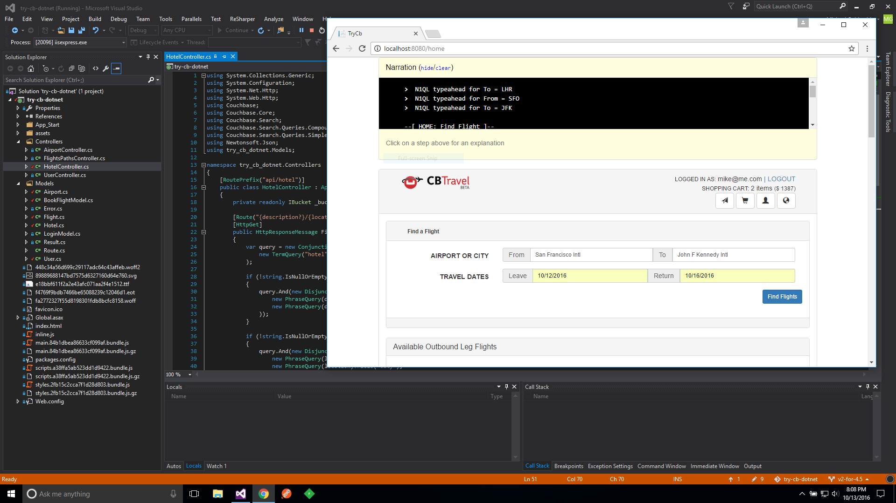

# Couchbase .NET travel-sample Application
This is a sample application for getting started with Couchbase Server 5.0 and the .NET SDK. The application runs a single page UI for demonstrating SQL for Documents (N1QL) and Full Text Search (FTS) querying capabilities. It uses Couchbase Server 5.0 together with ASP.NET Web API 2, Angular2 and Bootstrap.

The application is a flight planner that allows the user to search for and select a flight route (including the return flight) based on airports and dates. Airport selection is done dynamically using an angular autocomplete box bound to N1QL queries on the server side. After selecting a date, it then searches for applicable air flight routes from a previously populated database. An additional page allows users to search for Hotels using less structured keywords.



## Prerequisites
The following pieces need to be in place in order to run the application.

* Couchbase Server 5.0 or later with the travel-sample bucket setup
* Visual Studio 2015 Community or Professional
* Couchbase server Administrator user setup with password `password`

## Running the application
Clone the repository:

```bash
git clone https://github.com/couchbaselabs/try-cb-dotnet.git
```

Open Visual Studio and open _src/try-cb-dotnet.sln_ from where you downloaded or cloned the source repository. Run (F5 or Debug > Start Debugging) and if all goes well, this will start an IIS Express instance running the application on http://localhost:8080.

Note that when you run the application for the first time, it will make sure that all indexes are created for best performance, so it might take a bit longer.

## Configuration Options

By default the application will connect to the Couchbase Server on _localhost:8091_ and use the _travel-sample_ bucket. It will however separate user account data into the _default_ bucket (and these documents can be set to expire). All these options can be modified in `src/Web.Config`.

## Couchbase Server 5.0
There is a [5.0-updates](https://github.com/couchbaselabs/try-cb-dotnet/tree/5.0-updates) branch for the upcoming Couchbase Server 5.0 that has additional changes.
